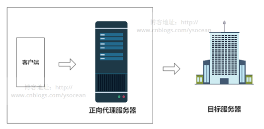
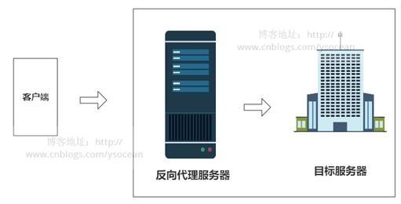
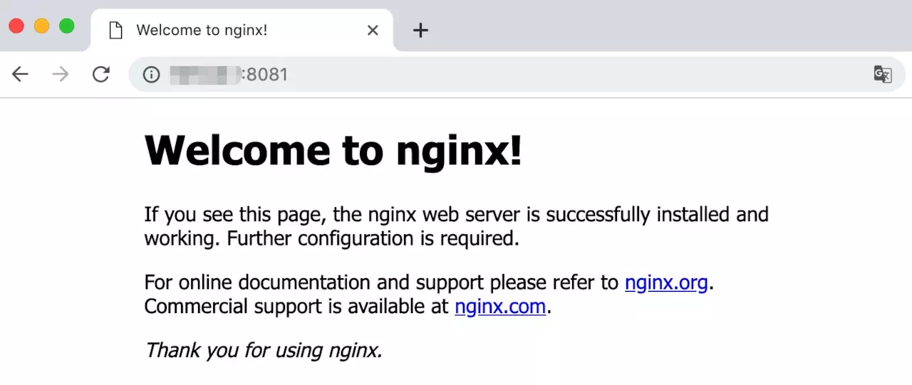
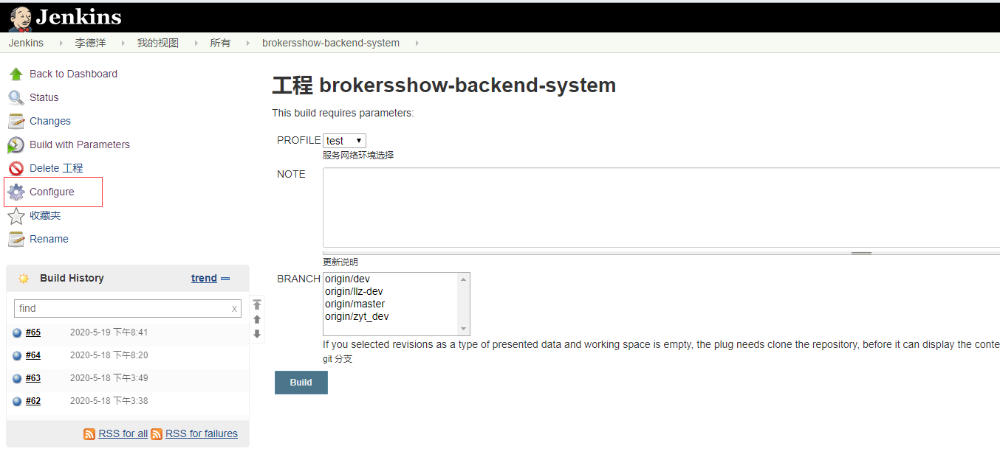
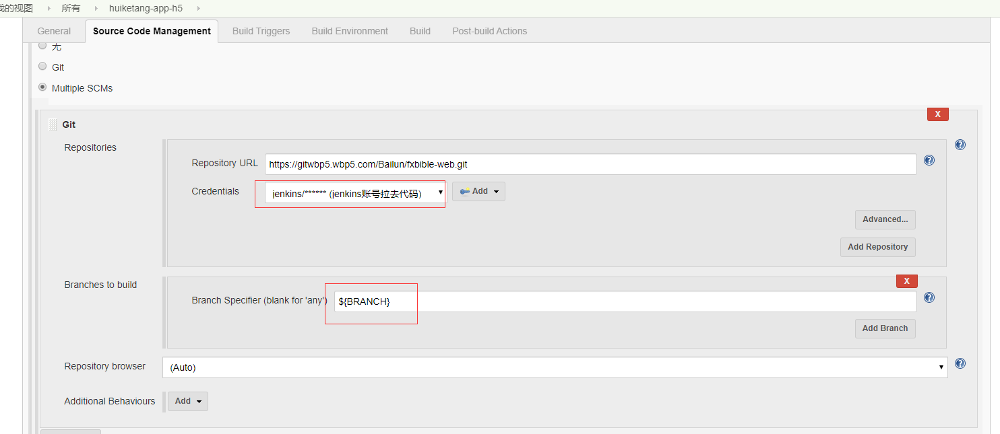
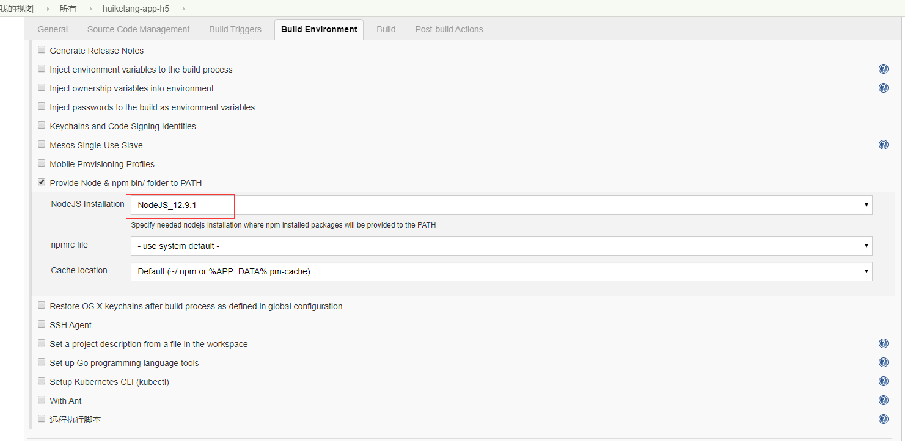
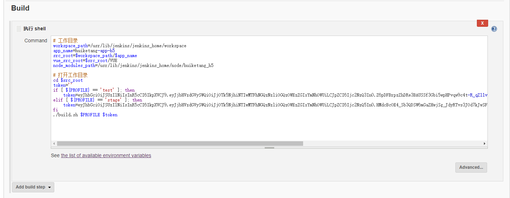

# web团队前端自动化构建讲解


## 概述

- nginx
- docker
- Jenkins

（安装不讲，教程很多）


## nginx

介绍：
Nginx 是异步框架的网页服务器，也可以用作反向代理、负载平衡器和HTTP缓存静态资源。






理解这两种代理的关键在于代理服务器所代理的对象是什么，正向代理代理的是客户端，我们需要在客户端进行一些代理的设置。而反向代理代理的是服务器，作为客户端的我们是无法感知到服务器的真实存在的。

总结起来还是一句话：正向代理代理客户端，反向代理代理服务器。


## nginx对我们来说

- 给我们的静态资源启一个web服务,单独响应缓存前端静态资源

nginx.conf 配置文件
```$xslt
    error_log  /var/log/nginx/error.log warn;
    pid        /var/run/nginx.pid;
    
    
    events {
        worker_connections  1024;
    }
    
    
    http {
        include       /etc/nginx/mime.types;
        default_type  application/octet-stream;
    
        log_format  main  '$remote_addr - $remote_user [$time_local] "$request" '
            '$status $body_bytes_sent "$http_referer" '
            '"$http_user_agent" "$http_x_forwarded_for"';
    
        access_log  /var/log/nginx/access.log  main;
    
        sendfile        on;
        #tcp_nopush     on;
    
        keepalive_timeout  65;
    
        gzip  on;
        gzip_types text/plain application/json application/x-javascript application/javascript text/css application/xml text/javascript image/jpeg image/gif image/png image/svg;
        include /etc/nginx/conf.d/*.conf;
        server_tokens   off;
        add_header X-Frame-Options sameorigin;
        add_header X-Content-Type-Options nosniff;
        add_header X-XSS-Protection "1; mode=block";
    }

```


## nginx对我们来说

接口转发， 跨域请求:
```$xslt
server {
    listen 80;
    server_name testwebpc.huiketang.com;

    root /app/dist;
    index index.html;

    location / {
        try_files $uri $uri/ @router;
    }

    location @router {
        rewrite ^.*$ /index.html last;
    }

    location /api {
        # 把 /api 路径下的请求转发给真正的后端服务器
        proxy_pass http://120.24.168.112:31321;
    }
}

```

实际请求http://120.24.168.112:31321/api的接口，被代理到请求该域名的80端口/api/下  


## Docker

概念
---
Docker初用只需要了解镜像、容器这两个概念就足够了。

- 镜像： 镜像是在运行时使用的文件系统和参数构成的。我们可以将其看作一个具有所需要的环境的微型的系统。
- 容器： 容器可以看作是镜像运行的一个实例。可以简单地将镜像和容器的关系看作是类和实例的关系。


## Docker操作

我们使用nginx的镜像作为例子，首先先下载nginx镜像
```$xslt
$ docker pull nginx
```

执行代码下载成功后我们可以查看系统中已存在的镜像的信息
```$xslt
$ docker image ls
REPOSITORY          TAG                 IMAGE ID            CREATED             SIZE
nginx               latest              53f3fd8007f7        2 weeks ago         109MB
```


执行代码这时候我们就有了一个nginx的镜像，我们使用该镜像来创建并运行一个容器，然后在浏览器查看该效果。
```$xslt
$ docker run -d -p 8081:80 --name mynginx nginx
```

执行代码其中,-d是指让容器在后台运行，-p是进行端口映射，将服务器的8081端口映射到容器内部的80端口，创建成功后会输出一串字符串表示创建成功，我们可以通过docker ps命令查看容器是否正在运行
```$xslt
$ docker ps
CONTAINER ID        IMAGE        ...               PORTS                  NAMES
6dd4380ba708        nginx        ...      0.0.0.0:8081->80/tcp            mynginx
```


复制代码看到该容器信息后，我们访问服务器的8081端口，就可以看到nginx的欢迎界面了。



## Docker实战

我们用nginx镜像为基础，修改该镜像并创建一个容器来运行一个vue应用。

1. 首先我们创建一个vue应用，先不进行修改，打包成名为dist的文件夹，然后在服务器上创建一个工作目录用于测试，将打包后的文件放到工作目录中。


2. 使用Dockerfile来执行一串的命令对镜像进行修改。首先我们创建一个Dockerfile并编写

```$xslt
# FROM关键字：取决于基于什么镜像构建
FROM nginx

# 将打包好的文件复制到容器中的该路径下
COPY dist/ /usr/share/nginx/html/

# 将修改的文件替换掉容器中的nginx配置
COPY default.conf /etc/nginx/conf.d/default.conf

```


3. 将文件都准备好后，我们构建该镜像并且创建、运行容器
```$xslt
# 要在Dockerfile所在路径下运行该命令，并且注意后面有个"."
$ docker build -t registry-vpc.cn-shenzhen.aliyuncs.com/stl-${mirror_tag}/$app_name:$PROFILE .
# 构建成功后，我们使用该镜像来运行容器
$ docker push registry-vpc.cn-shenzhen.aliyuncs.com/stl-${mirror_tag}/$app_name:$PROFILE
##阿里云部署容器
curl https://cs.console.aliyun.com/hook/trigger?token=$token
```


## Jenkins

- Jenkins是由Java语言编写的一个持续集成(CI)工具，主要用于持续、自动地构建项目。

过程：
1. 代码上传到github，Jenkins检测到github上代码有变化，将代码下载下来。
2. 代码下载之后，Jenkins自动下载项目所需要的依赖文件，并且将代码打包。
3. 通过我们前面定义好的Dockerfile，执行docker build命令，将打包好的文件放进容器内。
4. 部署成功，访问监听的端口测试是否成功。


## Jenkins关联github

在jenkins上创建一个项目，点击Configure配置。



接着选择源码管理的选项卡，填写具体的信息。




配置选择node环境




Build脚本




## build.sh
```$xslt
PROFILE=$1
token=$2

# 工作目录
src_root=$(pwd)
app_name=huiketang-backend-sys
node_modules_path=/usr/lib/jenkins/jenkins_home/node/huiketang_backend_sys

# 项目打包
cd $src_root
cp -rf ./package.json $node_modules_path
cd $node_modules_path
npm i
cd $src_root
ln -s $node_modules_path/node_modules node_modules
npm run build:$PROFILE
rm -rf ./node_modules

# 构建docker镜像
mirror_tag=''
source_nginx_conf=''
target_nginx_conf=./nginx/conf.d/app.conf
if [ ${PROFILE} == 'test' ]; then
    mirror_tag=test
    host='https://testadmin.huiketang.com/'
    source_nginx_conf=./nginx/conf.d/test.conf
elif [ ${PROFILE} == 'stage' ]; then
    mirror_tag=test
    host='https://preadmin.huiketang.com/'
    source_nginx_conf=./nginx/conf.d/stage.conf
elif [ ${PROFILE} == 'prod' ]; then
    mirror_tag=pro
    host='https://admin.huiketang.com/'
    source_nginx_conf=./nginx/conf.d/prod.conf
fi
mv $source_nginx_conf $target_nginx_conf
docker build -t registry-vpc.cn-shenzhen.aliyuncs.com/stl-${mirror_tag}/$app_name:$PROFILE .
docker push registry-vpc.cn-shenzhen.aliyuncs.com/stl-${mirror_tag}/$app_name:$PROFILE

# 部署服务
curl https://cs.console.aliyun.com/hook/trigger?token=$token

# 钉钉通知
webhook='https://oapi.dingtalk.com/robot/send?access_token=67ec26c66d72d7437a44e7fc5fe49323344cf84fb9e3118e50199d61e9d1f180'
title="后台管理系统发布了，环境：$PROFILE"
text="后台管理系统发布了，环境：$PROFILE \n\n [单击打开]($host) \n\n 更新说明:  \n\n$NOTE  \n\n"
curl $webhook \
    -H "Content-Type: application/json" \
    -d "{\"msgtype\": \"markdown\",
    \"markdown\":{
    \"title\":\"$title\",
    \"text\":\"$text\"
}}"

webhook='https://oapi.dingtalk.com/robot/send?access_token=29df1f36c4530d3f509d7e91dc0fe1a81a88f2d3e33fb917b90a9fc6d0eebe70'
curl $webhook \
    -H "Content-Type: application/json" \
    -d "{\"msgtype\": \"markdown\",
            \"markdown\":{
            \"title\":\"$title\",
            \"text\":\"$text\"
        }}"

```


## 谢谢观看
